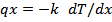
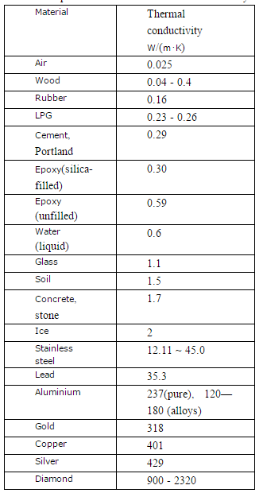
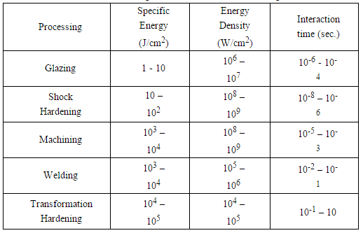
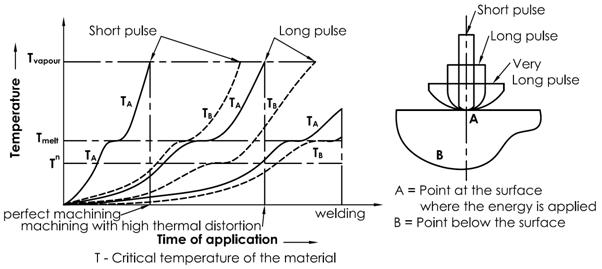

### Theory

### Pre-requisite
For better understanding of the experiment a candidate should acquire following knowledge
1. Modes of heat transfer
2. Basic knowledge of electrical discharge machining
3. Various terminologies related to pulse
4. Understanding of various relevant terms viz. latent heat of melting, latent heat of vaporization, latent heat of evaporation
5. Some hands on experience for MATLAB programming

### 1. Heat Conduction

Heat is defined as energy transferred by virtue of a temperature difference. It flows from regions of higher temperature to regions of lower temperature. It is customary to refer to different types of heat transfer mechanisms as modes. The basic modes of heat transfer are conduction, radiation, and convection.

#### 1.1 Conduction

- Conduction is the transfer of heat from one part of a body at a higher temperature to another part of the same body at a lower temperature, or from one body at a higher temperature to another body in physical contact with it at a lower temperature. The conduction process takes place at the molecular level and involves the transfer of energy from the more energetic molecules to those with a lower energy level.
- This can be easily visualized within gases, where we note that the average kinetic energy of molecules in the higher-temperature regions is greater than that of those in the lower-temperature regions. The more energetic molecules, being in constant and random motion, periodically collide with molecules of a lower energy level and exchange energy and momentum. In this manner there is a continuous transport of energy from the high-temperature regions to those of lower temperature.
- In liquids the molecules are more closely spaced than in gases, but the molecular energy exchange process is qualitatively similar to that in gases.
- In solids that are non-conductors of electricity (dielectrics), heat is conducted by lattice waves caused by atomic motion. In solids that are good conductors of electricity, this lattice vibration mechanism is only a small contribution to the energy transfer process, the principal contribution being that due to the motion of free electrons, which move in a similar way to molecules in a gas.
- At the macroscopic level the heat flux (i.e., the heat transfer rate per unit area normal to the direction of heat flow) qx is proportional to the temperature gradient:
- Mathematically, it can be expressed as

Where the proportionality constant k is a transport property known as the thermal conductivity and is a characteristic of the material. The minus sign is a consequence of the fact that heat is transferred in the direction of decreasing temperature. In physics, thermal conductivity, k, is the property of a material that indicates its ability to conduct heat. Thermal conductivity is measured in watts per kelvin per metre (W/m·K).The reciprocal of thermal conductivity is thermal resistivity. Approximate values of thermal conductivity, k, for some common materials are enlisted in following table 1.

#### 1.2 Pulsed Heating of materials with high energy density pulses

The variation in pulse time results into wide spectrum of machining processes right from glazing to heat treatment. Table 2 represents the working domain of specific energy, power density and interaction time for various processes. Figure 1.3 represents the effect of variation in pulse heat energy resulting in variation of temperature at various points. Heat is applied at point 'A' on the surface, for any processing operation, the temperature at 'A' will rise faster than the point 'B' which is below the surface and receives heat through conduction only. The temperature at point 'B' will lag behind that of 'A'.

- In conventional thermal processing, because of low energy rate input, though the temperature of 'B' will lag behind 'A', yet it will follow a very closer path. So the desired change is observed at 'A' and the undesired one at 'B'. This undesired change may be referred as thermal damage, distortion, or inaccuracy etc. as defined in different processing operations. Hence, higher energy level is applied for a shortened time. The net result is raising the temperature at 'A' faster as compared to the previous case and the rate of temperature rise at 'B' will not be that fast as compared to 'A' (because of conduction); there exist a wide gap in between the TA and TB curve. Hence, at this point one can observe vaporization at point 'A' and thermal distortion at point 'B'. This condition again varies when one applies higher energy rate input for a very short time which creates vaporization at 'A' but no change at point 'B' as it is below the recrystallisation temperature during the pulse interval.
- In any thermal process like WEDM, higher density is applied in pulsations that brings in desired change, with higher accuracy and without any disturbing characters (changes) as associated with conventional thermal processes.
- The Wire EDM process is predominantly a thermal process and therefore some annealing of the work piece can be expected in a zone just below the machined surface. In addition some of the work piece material melted by the discharge is expelled into the bulk of the work piece, resulting in an exceedingly hard surface. The depth of the annealed layer is proportional to the amount of power used in the cutting operation. It will range from 5μm for finish cutting, to approximately 20&mu;m for high metal removal rates. The amount of annealing is usually about 2 points of hardness below the parent metal for finish cutting. This happens when the finishing operation done by WEDM is after heat treatment; otherwise the reverse is observed while machining a material in annealed condition. In the rough cuts, the annealing effect is approximately 5 points below the parent metal. Figure 1.3 shows the relationship of the heat- affected zone to the cutting conditions.
- Since the annealing effect is most common when unstable machining conditions exist, it can be reduced by choosing conditions that produce better stability for example, by choosing electrodes that produce more stable machining at lower rates. Using a finish cut operation in order to remove the annealed material left by the previous high-speed rough cut.